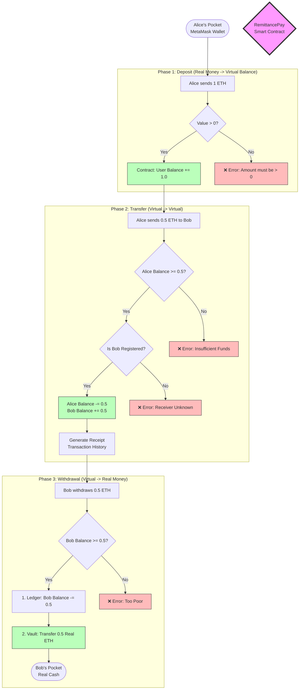

# Smart Contract Explained (`RemittancePay.sol`)

**File:** `contracts/RemittancePay.sol`

---

## 📖 The Story: How it Works (Non-Technical)

Imagine **RemittancePay** is a transparent, robotic bank vault in the cloud. It has no human employees. It follows strict rules that everyone can see but no one can break.

### The Characters
- **Alice**: A user who wants to send money.
- **Bob**: A user who receives money.
- **The Contract**: The robot banker.

### 🖼️ Visual Flow: The Lifecycle of Money

### 🖼️ Visual Flow: The Lifecycle of Money



### Scene 1: Joining the Bank (`createProfile`)
Alice walks up to the robot. She can't just walk in; she needs an ID card.
- **Action**: Alice gives her name ("Alice") and email.
- **Robot's Response**: The robot creates a permanent file folder for "Alice" linked to her digital wallet key. Now she is a "Registered User".

### Scene 2: Making a Deposit (`addFunds`)
Alice wants to put money in her account.
- **Action**: Alice takes 1 ETH (digital coin) from her pocket (MetaMask) and pushes it into the robot's slot.
- **Robot's Response**: The robot takes the physical coin, puts it in the Main Vault, and writes "Alice: +1 ETH" in its ledger.
- **Result**: The money is now safe inside the robot, and Alice has a balance of 1.

### Scene 3: Sending Money (`sendMoney`)
Alice wants to send 0.5 ETH to Bob.
- **Action**: Alice tells the robot, "Move 0.5 from me to Bob."
- **Robot's Checks**:
    1.  "Is Alice registered?" (Yes)
    2.  "Is Bob registered?" (Yes)
    3.  "Does Alice have 0.5 ETH?" (Yes, she has 1.0)
- **Robot's Response**: The robot erases "1.0" from Alice's line and writes "0.5". It finds Bob's line and adds "0.5".
- **Result**: The real coins *never left the vault*. The robot just updated the numbers. This is fast and cheap!

### Scene 4: Bob Withdraws (`withdrawFunds`)
Bob sees he has 0.5 ETH and wants to buy a pizza in the real world.
- **Action**: Bob tells the robot, "Give me my 0.5 ETH back."
- **Robot's Response**: It checks Bob's balance. It opens the Main Vault, takes out 0.5 real ETH coins, and hands them to Bob.
- **Result**: Bob's internal balance goes to 0. He walks away with the cash.

<div style="page-break-after: always;"></div>

---

## ⚙️ The Code: How the Machine Thinks (Technical)

Here is the actual code that runs the story above.

### 1. The Database (`struct` & `mapping`)

```solidity
// The Digital Filing Cabinet
struct UserProfile {
    string name;    // "Alice"
    uint256 balance; // How much she owns
}

mapping(address => UserProfile) public profiles; 
// Meaning: "If you give me a Wallet ID, I will show you the Profile."
```

### 2. Scene 1 Code: Registration

```solidity
function createProfile(string memory _name) public {
    // The robot creates the folder
    profiles[msg.sender] = UserProfile({
        name: _name,
        verified: false
    });
    
    // The stamp of approval
    registeredUsers[msg.sender] = true;
}
```

### 3. Scene 2 Code: Deposit

```solidity
function addFunds() public payable { 
    // 'payable' allows the robot to accept real money
    
    require(msg.value > 0, "Need money!"); 
    // "Don't waste my time with empty hands."

    balances[msg.sender] += msg.value;
    // The robot writes the new number in the ledger
}
```

### 4. Scene 3 Code: The Transfer

```solidity
function sendMoney(address _to, uint256 _amount) public {
    // The Checks (The "Bouncer")
    require(balances[msg.sender] >= _amount, "Not enough money");
    
    // The Math (The "Ledger Update")
    balances[msg.sender] -= _amount; // Alice loses
    balances[_to] += _amount;        // Bob gains
    
    // The Receipt
    emit TransactionSent(msg.sender, _to, _amount);
}
```
**Analogy**: Notice there is no "sending" command here. It's just math. `Balance A minus 5`, `Balance B plus 5`. That's why it's efficient.

### 5. Scene 4 Code: Withdrawal

```solidity
function withdrawFunds(uint256 _amount) public {
    require(balances[msg.sender] >= _amount, "You are poor");

    // 1. Update the ledger FIRST (Safety Rule)
    balances[msg.sender] -= _amount;

    // 2. Open the vault door and send real money
    payable(msg.sender).transfer(_amount);
}
```
**Safety Note**: We always subtract the balance *before* sending the money. This prevents a hacker from tricking the robot into sending the money twice before it has time to update the list!

<div style="page-break-after: always;"></div>

---

## 📚 Beginner's Glossary

| Word | Simple Meaning |
|---|---|
| **Smart Contract** | A robot banker that lives on the internet and follows strict code. |
| **Address** | Like a bank account number (starts with `0x...`). |
| **Ether (ETH)** | The digital money used by this bank. |
| **Gas** | The small "stamp fee" you pay to send a letter (transaction) to the robot. |
| **Ledger** | A permanent notebook where the robot writes down who owns what. |
