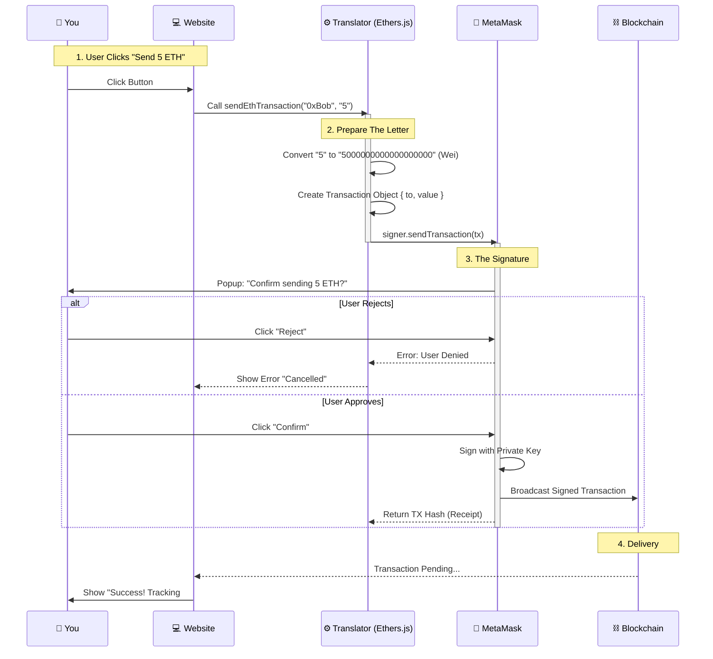

# Integration Layer Explained (`lib/metamask-utils.ts`)

**File:** `lib/metamask-utils.ts`

---

## 📖 The Story: How it Works (Non-Technical)

Think of this file consistently as **The Translator**.

- **The Problem:** Your web browser (Chrome) speaks English (`JavaScript`). The Blockchain speaks a strange alien language (`Solidity`). They cannot understand each other directly.
- **The Solution:** We hire a Translator (this file) to stand in the middle.

### 🖼️ Visual Flow: Sending a Letter

### 🖼️ Visual Flow: Sending a Letter



### Scene 1: Checking for Signal (`getProvider`)
Before we start talking, the Translator checks if you have a phone (MetaMask).
- **Action:** The website loads.
- **Translator:** "Do you have the MetaMask app installed?"
- **If Yes:** "Great, we can talk to the blockchain."
- **If No:** "Sorry, I can't help you until you get a phone."

### Scene 2: The Introduction (`connectMetaMask`)
You click "Connect Wallet".
- **Translator:** knocks on your phone's door.
- **You (MetaMask):** You see a popup asking "Allow RemittancePay to see your public address?"
- **Action:** You click "Yes".
- **Result:** The Translator gets your public ID card (`0x123...`) and tells the website who you are.

### Scene 3: Sending a Letter (`sendEthTransaction`)
You want to send money.
- **You:** "Send 5 ETH to Bob."
- **Translator:** "Okay, wait." (Converts 5 ETH to `5000000000000000000` Wei — the alien number format).
- **Translator:** Hands you a contract to sign.
- **You:** You press "Confirm" in MetaMask (signing into ink).
- **Translator:** Runs to the post office (Node) and drops the letter in the mailbox.
- **Result:** Returns a tracking number (`tx hash`) so you can watch delivery.

<div style="page-break-after: always;"></div>

---

## ⚙️ The Code: How the Machine Thinks (Technical)

### 1. Connection (The Knock)

```typescript
export const connectMetaMask = async () => {
  // 1. Get the Phone
  const provider = new ethers.BrowserProvider(window.ethereum);

  // 2. Knock on the door (Request Access)
  const accounts = await provider.send("eth_requestAccounts", []);
  
  // 3. Get the ID
  return accounts[0]; // "0x123..."
}
```

### 2. Sending Money (The Postman)

```typescript
export const sendEthTransaction = async (toAddress, amount) => {
  // 1. Get the Pen (Signer)
  const signer = await provider.getSigner();

  // 2. Translate the Amount (English -> Alien)
  const value = ethers.parseEther(amount); 
  // "1.0" becomes "1000000000000000000"

  // 3. Mail the Letter
  const tx = await signer.sendTransaction({
    to: toAddress,
    value: value
  });

  // 4. Give Tracking Number
  return tx.hash;
}
```
**Key Concept**: We never touch your private key. We just prepare the letter, and *you* sign it with your wallet app.

<div style="page-break-after: always;"></div>

---

## 📚 Beginner's Glossary

| Word | Simple Meaning |
|---|---|
| **Ethers.js** | The library used to talk to the blockchain (The "Translator"). |
| **Provider** | The connection to the blockchain network (The "Signal"). |
| **Signer** | Your ability to approve transactions (The "Pen"). |
| **Wei** | The smallest unit of Ether (1 ETH = 1,000,000,000,000,000,000 Wei). |
| **Hash** | A unique receipt number for tracking your transaction. |
