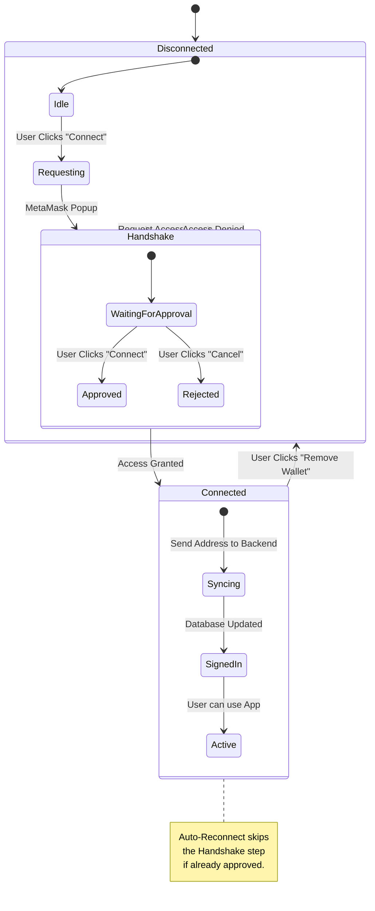

# Wallet Flow (`metamask-button.tsx` & `auth-context.tsx`)

**Files:**
- `components/metamask-button.tsx` (UI)
- `lib/auth-context.tsx` (Logic)

---

## 📖 The Story: How it Works (Non-Technical)

Think of this as the **Login Screen**.

### 🖼️ Visual Flow: The Handshake

### 🖼️ Visual Flow: The Connection Lifecycle



### The Concept
Just like logging into Facebook with your email, you log into RemittancePay with your **Crypto Identity**.
- **The Difference:** Facebook asks for a password. RemittancePay asks for a **Signature**.

### Scene 1: The Request (`Connect Wallet`)
You visit the site.
- **You:** Click the big blue "Connect Wallet" button.
- **The Site:** "Hey MetaMask, is this person cool?"

### Scene 2: The Handshake (`Approve`)
- **MetaMask:** Pops up and asks *you*: "RemittancePay wants to know your public address. Is that OK?"
- **You:** Click "Connect".
- **Result:** You have just exchanged business cards. The site now knows your public address (e.g., `0xKB...`) but it **cannot** touch your money yet.

### Scene 3: Remembering You (Auto-Reconnect)
You close the tab and come back tomorrow.
- **The Site:** "Wait, I recognize that browser! Are you still logged in to MetaMask?"
- **MetaMask:** "Yep, here is their ID card."
- **Result:** You are logged in instantly without clicking anything.

### Scene 4: Breaking Up (Remove Wallet)
You want to log out.
- **You:** Click "Remove Wallet".
- **The Site:** "Okay, forgetting you now."
- **The Site:** Tells MetaMask "Please revoke permissions so I can't see them anymore."
- **Result:** Next time you visit, you are a stranger again.

<div style="page-break-after: always;"></div>

---

## ⚙️ The Code: How the Machine Thinks (Technical)

### 1. The Handshake Logic

```typescript
const handleConnect = async () => {
    // 1. Trigger the popup
    const accounts = await window.ethereum.request({ 
        method: "eth_requestAccounts" 
    });
    
    // 2. Get the address
    const myAddress = accounts[0];

    // 3. Tell the Backend ("Sync")
    await connectWallet(myAddress);
}
```

### 2. The Auto-Login Logic

```typescript
useEffect(() => {
    // Runs when page loads
    
    // 1. Silent Check
    const silentAddress = await getConnectedAccount();
    
    // 2. If found, auto-login
    if (silentAddress) {
        setCurrentAddress(silentAddress);
    }
}, []);
```
**Key Concept**: `eth_requestAccounts` triggers a popup. `eth_accounts` (used in auto-login) is silent and only works if you already approved the site before.

<div style="page-break-after: always;"></div>

---

## 📚 Beginner's Glossary

| Word | Simple Meaning |
|---|---|
| **Handshake** | The process where you agree to let the website see your wallet address. |
| **Permission** | Giving the site read-only access (like showing ID, not giving keys). |
| **Auto-Reconnect** | The site remembering your browser so you don't have to login again. |
| **Revoke** | Cancelling the permission, like taking back your ID card. |
